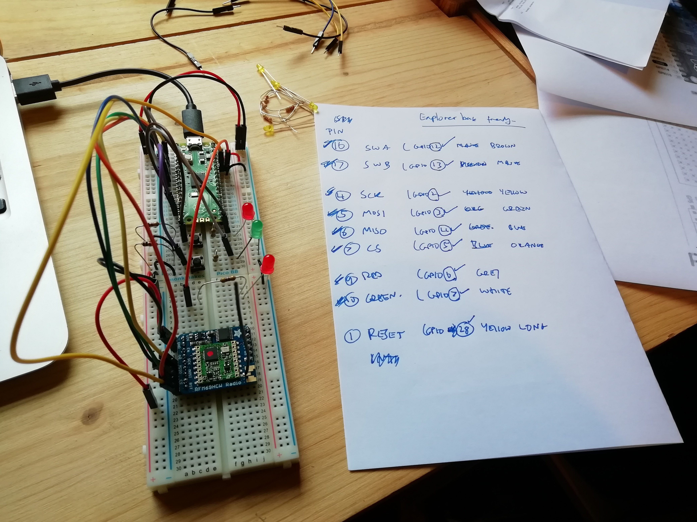

# pico-energenie
Control Energenie switches using the Raspberry Pi Pico

This code is pure python 3, and can be loaded onto a Raspberry Pi Pico
that is running the default MicroPython build that the Thonny IDE provides.

(It might work with other Python builds such as the Pimoroni MicroPython
and CircuitPython, but I haven't tested those combinations).

This code currently implements just the OOK Transmit for the old-style
[Green Button](https://cpc.farnell.com/energenie/ener002/1-gang-socket-radio-controlled/dp/PL14928)
devices (receive-only devices). It will soon also support
the newer two-way MiHome devices that report their status and energy
readings, such as the whole-house monitor, the eTRV, the open or movement sensors,
etc. (You can get working code for all those devices in my other Raspberry Pi
Energenie repository as linked below).

Many Energenie devices support the one-way protocol, such as all the
light switches, all the wired-in wall sockets, the dimmer switch,
the 4-way extension, and the 3kW relay.

It is mostly a port of the code from my Raspberry Pi Energenie repo here:

[github.com/whaleygeek/pyenergenie](github.com/whaleygeek/pyenergenie)

# Parts needed

[Raspberry Pi Pico](https://shop.pimoroni.com/products/raspberry-pi-pico?variant=32402092326995)

[Breadboard and Jumpers](https://monkmakes.com/pico_kit1.html)

[Adafruit RFM69HCW radio](https://shop.pimoroni.com/products/adafruit-rfm69hcw-transceiver-radio-breakout?variant=19594984071)

[Green button socket](https://cpc.farnell.com/energenie/ener002/1-gang-socket-radio-controlled/dp/PL14928)

# Wiring it up




```
PIN GPIO Purpose
16  GP12 Switch A (on)
17  GP13 Switch B (off)
4   GP2  SCK
5   GP3  MOSI
6   GP4  MISO
7   GP5  CS
9   GP6  RED LED
10  GP7  GREEN LED
    GP28  RESET
```
NOTE: The RST pin of RFM69 board must be pulled permanently low
alternatively wire it to a GPIO. The EN pin can be left disconnected
as it defaults to 'enabled'.

You need a 173mm bit of wire soldered to the ANT pin (bottom right)

# Pairing a socket

To 'learn' the code to a socket, hold the green button on socket until
the socket LED flashes. Then use this code:
```
  import energenie
  light = Socket()
  light.on()
```

The LED on the socket should flash a few times and the code is learnt.

# Tested the paired socket
Use this simple code at the REPL prompt, to test your switch works:

```
  import energenie
  light = Socket()
  test(light)
```
It will switch on and off repeatedly.
CTRL-C to stop

# Switching the socket on and off with a simple user interface

To run a simple user interface that uses the two buttons and two LEDs wired up
earlier, run this code at the REPL, or save it as your main.py and reboot.

```
   import onoff
```

Press button A to turn the switch on

Press button B to turn the switch off

# Using more than one socket

Device addresses are 20-bit numbers. The address baked into this example code
is 0xA0170, which happens to be the serial number of a battery powered hand
controller I own. But you can set a different address within that 20-bit
range and 'learn' any switches you have to that new code (as above).

```
light2 = Socket(0x6C6C6)
light2.on()
```

If you have a 4-gang socket (or a dimmer switch), there are 4 sub-channels
on those devices, and you can set the sub channel as follows:

```
4gang_A = Socket(channel=1)
4gang_B = Socket(channel=2)
4gang_C = Socket(channel=3)
4gang_D = Socket(channel=4)
4gang_ALL = Socket(channel=0)
```

Note that channel 0 means 'all channels'. Thus to turn all sockets off
on your 4-gang, use this:

```
4gang_ALL.off()
```

@whaleygeek May 2022

